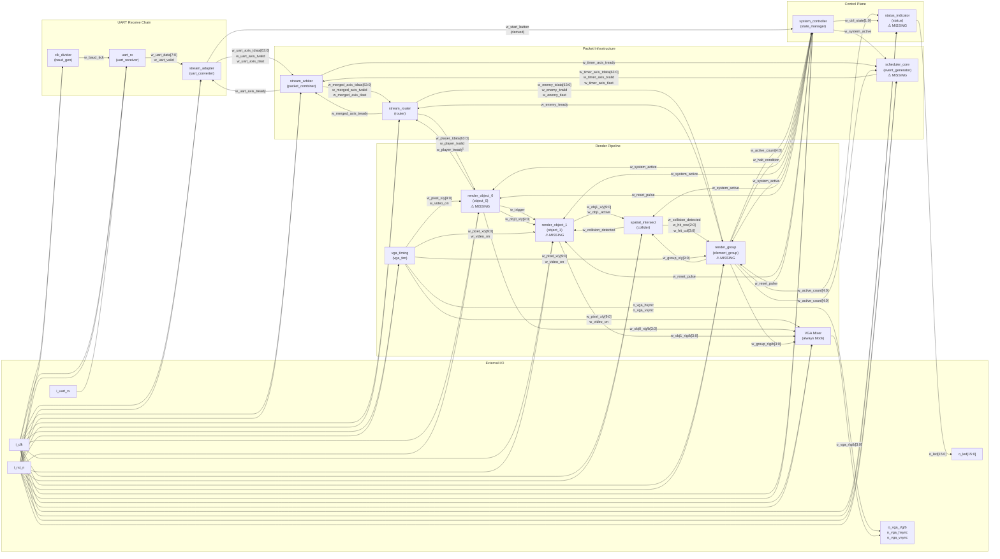

# Snake-On-FPGA — System Architecture

## Top-Level Block Diagram



## Signal Flow Summary

### 1. UART Receive Chain
```
i_uart_rx → uart_rx → stream_adapter → stream_arbiter
                ↑
          clk_divider (w_baud_tick)
```
Serial bytes arrive on `i_uart_rx`, get deserialized by `uart_rx` (clocked at 16× baud via `clk_divider`), then `stream_adapter` assembles 8 bytes into a 64-bit AXI-Stream packet.

### 2. Packet Merging & Routing
```
stream_adapter ──┐
                 ├─→ stream_arbiter ──→ stream_router ──→ Port 0 (Player)
scheduler_core ──┘                                   ──→ Port 1 (Bullet, unused)
                                                     ──→ Port 2 (Reserved)
                                                     ──→ Port 3 (Enemy)
```
`stream_arbiter` merges UART packets (priority) with timer-generated packets. `stream_router` demuxes by packet type byte (`tdata[7:0]`): `0x01` → player, `0x02` → bullet, `0x03` → enemy.

### 3. Control Plane
```
w_start_button ──→ system_controller ──→ w_system_active (gates all movement)
w_active_count ──┘                   ──→ w_reset_pulse (resets render objects)
w_halt_condition ┘                   ──→ o_ctrl_state (MENU/PLAYING/VICTORY/GAMEOVER)
```
Derives `w_start_button` from UART packets (type `0x01`, direction `0x09`). State machine controls game lifecycle.

### 4. Render Pipeline
```
                    ┌─ render_object_0 (player) ─── w_trigger ──→ render_object_1 (projectile)
stream_router ──────┤                                                      │
                    └─ render_group (enemies) ←── collision ←── spatial_intersect ←─┘
```
- **render_object_0**: Player sprite, positioned by UART direction commands
- **render_object_1**: Projectile, spawns at player position on trigger
- **render_group**: Enemy grid, moves via scheduler packets
- **spatial_intersect**: AABB collision between projectile and enemy grid

### 5. VGA Output
```
vga_timing → pixel_x/y, video_on → all render objects
                                          ↓
obj0_rgb, obj1_rgb, group_rgb → VGA Mixer (priority: obj1 > obj0 > group) → o_vga_r/g/b
```
Priority compositing: projectile on top, then player, then enemies. Black = transparent.
